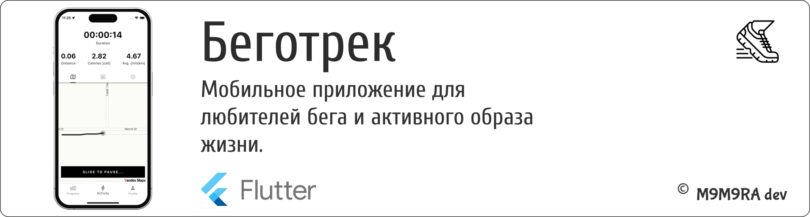
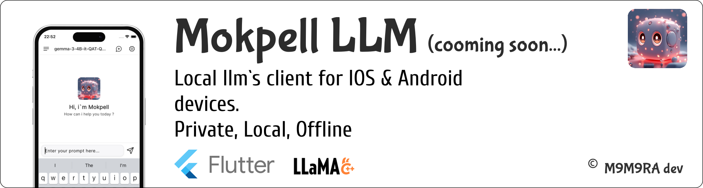

# Привет, я Игорь (@m9m9ra | Developer) 👋

<!--
## 🚀 Информация обо мне
Middle Flutter/React-Native developer.
-->
## 💻 Навыки (skills)

## 📂 Проекты (projects)
<!-- - [Беготрек: бег, ходьба, фитнес, GPS трекер](https://www.rustore.ru/catalog/app/com.m9m9ra.running)  
  Беготрек — это мобильное приложение для любителей бега и активного образа жизни. 
  Оно позволяет пользователям отслеживать свои тренировки, устанавливать цели и анализировать прогресс.  -->
  <!-- https://www.rustore.ru/catalog/app/com.m9m9ra.running -->

⠀

<!--
- [Интелект]() - 
  
  https://www.rustore.ru/catalog/app/com.m9m9ra.todois

  
- [TODOIS](https://www.rustore.ru/catalog/app/com.m9m9ra.todois) - 
  это мощное приложение для управления задачами
  специально разработанное для пользователей Android. 
  Оно поможет вам организовать своё время и достичь ваших целей с легкостью.
  https://www.rustore.ru/catalog/app/com.m9m9ra.todois
-->
<!-- ## 🛠 Демонстрации

<!--

--->

## 📫 Контакты
- [Telegram @m9m9ra](https://t.me/m9m9ra)
- [Telegram_channel @m9m9ra_channel](https://t.me/m9m9ra_channel)
- [Email: vasa4g@gmail.com](mailto:vasa4g@gmail.com)

<!--
## 🛠 Технологии

| Технология   | Уровень      | Проект       |
|--------------|--------------|--------------|
| Flutter      | ★★★★★        | [TODOIS](https://www.rustore.ru/catalog/app/com.m9m9ra.todois) |
| React-Native | ★★★★★        | [Беготрек_beta](https://github.com/m9m9ra/RN-running-mobile/tree/v0.0.5) |
| Dart         | ★★★★☆        | [Coming soon]|
| TypeScript   | ★★★★☆        | [Not A Bot](https://github.com/m9m9ra/not-a-bot) |

m9m9ra/m9m9ra is a ✨ special ✨ repository because its `README.md` (this file) appears on your GitHub profile.
You can click the Preview link to take a look at your changes.
--->

