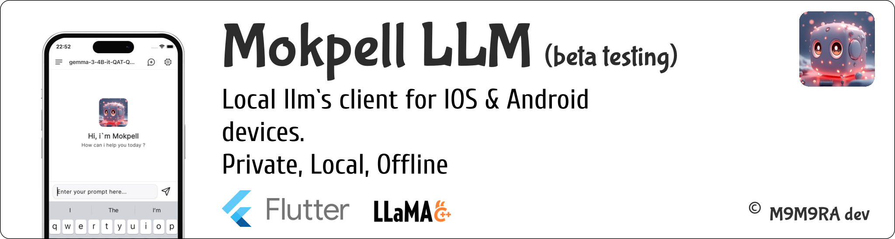

<!--
 _____ ______   ________  _____ ______   ________  ________  ________          ________  _______   ___      ___ 
|\   _ \  _   \|\  ___  \|\   _ \  _   \|\  ___  \|\   __  \|\   __  \        |\   ___ \|\  ___ \ |\  \    /  /|
\ \  \\\__\ \  \ \____   \ \  \\\__\ \  \ \____   \ \  \|\  \ \  \|\  \       \ \  \_|\ \ \   __/|\ \  \  /  / /
 \ \  \\|__| \  \|____|\  \ \  \\|__| \  \|____|\  \ \   _  _\ \   __  \       \ \  \ \\ \ \  \_|/_\ \  \/  / / 
  \ \  \    \ \  \  __\_\  \ \  \    \ \  \  __\_\  \ \  \\  \\ \  \ \  \       \ \  \_\\ \ \  \_|\ \ \    / /  
   \ \__\    \ \__\|\_______\ \__\    \ \__\|\_______\ \__\\ _\\ \__\ \__\       \ \_______\ \_______\ \__/ /   
    \|__|     \|__|\|_______|\|__|     \|__|\|_______|\|__|\|__|\|__|\|__|        \|_______|\|_______|\|__|/    
                                                                                                                

https://tools.picsart.com/text/font-generator/bold/

m9m9ra/m9m9ra is a ✨ special ✨ repository because its `README.md` (this file) appears on your GitHub profile.
You can click the Preview link to take a look at your changes.
--->

# 𝗛𝗲𝗹𝗹𝗼 𝗶`𝗺 𝗜𝗴𝗼𝗿 (𝗺9𝗺9𝗿𝗮)

## 💻 𝗠𝘆 𝗧𝗲𝗰𝗸 𝗦𝘁𝗮𝗰𝗸 (Навыки)

## 📂 𝗖𝘂𝗿𝗿𝗲𝗻𝘁𝗹𝘆 𝘄𝗼𝗿𝗸𝗶𝗻𝗴 𝗼𝗻 (Проекты)

<table>
  <tr>
    <th align="left">
      Беготрек \ 𝗫𝗥𝘂𝗻𝗻𝗲𝗿 (𝗯𝗲𝘁𝗮)
    </th>
    <th align="left">
      𝗠𝗼𝗸𝗽𝗲𝗹𝗹 𝗟𝗟𝗠 (𝗼𝗽𝗲𝗻 𝗯𝗲𝘁𝗮 𝘁𝗲𝘀𝘁𝗶𝗻𝗴)
    </th>
  </tr>
  <tr>
    <td>
      
      <a href="https://testflight.apple.com/join/GJCPYcQM">
        

          
        

      </a>
    </td>
    <td>
      
      <a href="https://testflight.apple.com/join/EPVKUNNa">
        

          
        

      </a>
    </td>
  </tr>

</table>

<!--

⠀
<a>

</a>

-->

## 📫 𝗖𝗼𝗻𝘁𝗮𝗰𝘁𝘀 𝗺𝗲 (Контакты)
- [Telegram @m9m9ra](https://t.me/m9m9ra)
- [Telegram_channel @m9m9ra_channel](https://t.me/m9m9ra_channel)
- [Email: vasa4g@gmail.com](mailto:vasa4g@gmail.com)

<!--
## 𝗦𝘁𝗮𝘁𝘀

-->
🄼9🄼9🅁🄰 🄳🄴🅅

